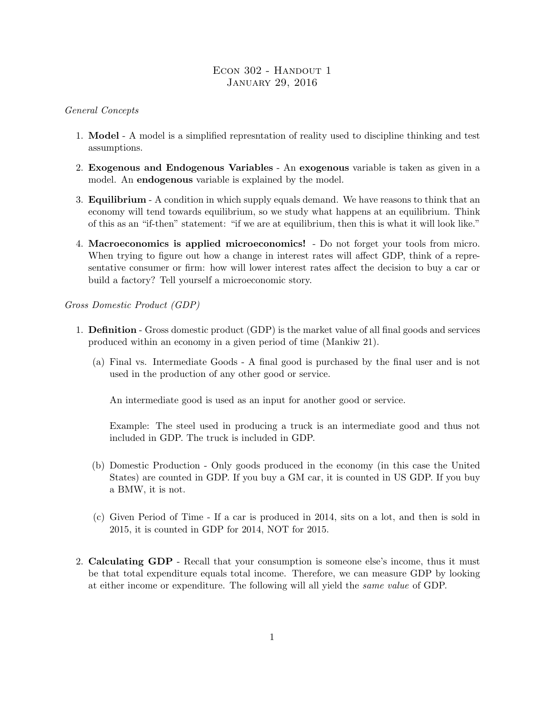
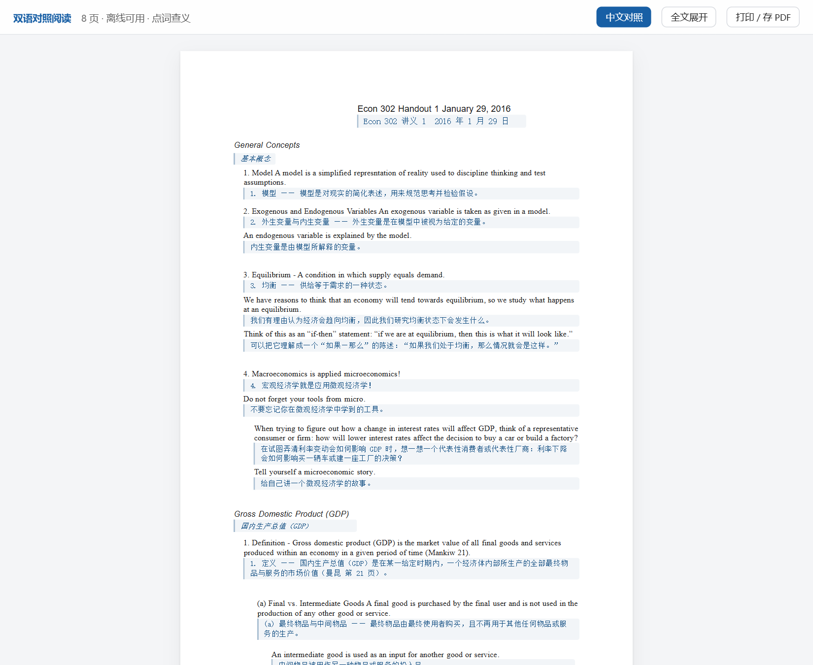
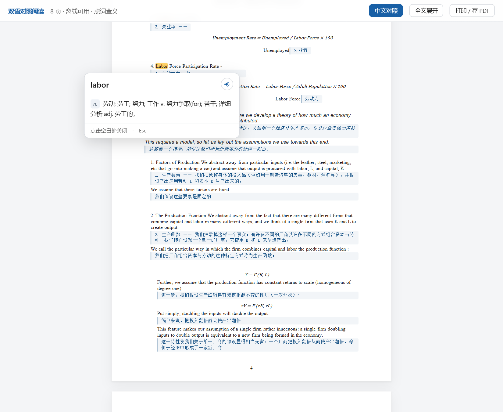

# doc-bilingual-reader

**中文** | [English](README.en.md)

把英文文档（论文 PDF / Word）翻译成中文，生成**一个自包含的 HTML 阅读器**：
保留原版排版，每句英文下方逐句对照中文，英文单词可点击查释义、音标并朗读，图表里的文字同样可点。产物完全离线、可直接转发。

> 零外部依赖产物：图片 base64 内联、词典内联、无 CDN、无网络请求。
> 查词在构建期一次性完成，读者点击时是纯本地查表——即时、离线、永不失败。

## 效果演示

以一份 8 页宏观经济学讲义（LaTeX PDF）为例：

| 原版 PDF | 双语对照 HTML |
|---|---|
|  |  |

点词查义（音标 + 词性 + 中文释义，纯本地弹窗）：



> 演示截图来自公开课程讲义（Econ 302 Handout 1，曼昆宏观经济学），仅用于功能演示。

## 功能

- **保留原版排版** —— PDF 每个字符的坐标被复刻，用绝对定位还原版式，不做流式重排
- **逐句中英对照** —— 每句英文下方直接给出中文，不是逐词对照
- **点词查义** —— 每个英文单词可点击，弹出音标、词性、中文释义；释义在生成时预查好内联
- **离线发音** —— 用浏览器本地语音合成朗读，不联网
- **图表内文字可点** —— 图片区域用 OCR 生成透明热区，图里的词也能点
- **公式识别为文本** —— 公式不走图片裁剪，识别成文本 / LaTeX 输出，可复制、可检索
- **译文质量硬性保证** —— 构建时审核，缺句 / 占位符 / 未翻译会直接构建失败，不会带病交付

## 快速使用

```bash
# 环境准备（pymupdf 必需；OCR 三项仅用于图表文字热区，装不上可跳过）
PY="C:/Users/zhang/.workbuddy/binaries/python/envs/default/Scripts/python.exe"
"$PY" -m pip install pymupdf pillow numpy rapidocr-onnxruntime

# 1. 抽取文本 + 坐标 + 切句
"$PY" scripts/extract.py input.pdf -o model.json --stats

# 1b. LaTeX 排版的 PDF 必须做合并预处理（普通 Word/网页导出的 PDF 跳过）
"$PY" scripts/merge_lines.py model.json -o merged.json --formulas formulas.json

# 2. （模型）逐句翻译，产出 translations.json + terms.json

# 3a. 预查并内联全部单词释义
"$PY" scripts/prefetch_dict.py merged.json -o dict.json --terms terms.json --cache .dictcache.json --workers 4

# 3b. 图表内文字 → 可点击热区（有图片时）
"$PY" scripts/ocr_hotspots.py merged.json -o hotspots.json --min-conf 55

# 4. 生成最终 HTML（先过译文审核，缺句/占位/未翻译会退出码 3 拒绝构建）
"$PY" scripts/build_html.py merged.json translations.json dict.json -o out.html --hotspots hotspots.json --title "论文标题 · 双语对照"
```

完整流程与设计决策见 [SKILL.md](SKILL.md)。

## 工作流程

```
extract.py        抽取文本 + 坐标 + 切句        → model.json
（模型逐句翻译）                                → translations.json + terms.json
prefetch_dict.py  预查并内联全部单词释义         → dict.json
ocr_hotspots.py   识别图表内文字                 → hotspots.json
build_html.py     生成最终 HTML（带译文审核）    → out.html
```

## 词典数据源

查词在**生成阶段一次性完成**，结果内联进 HTML；点击时是纯本地查表，零网络请求。不配置词库会大面积「未收录」：

- [ECDICT](https://github.com/skywind3000/ECDICT)（`ecdict.csv`，77 万词条）：

```bash
"$PY" scripts/prefetch_dict.py model.json -o dict.json \
  --terms terms.json --ecdict /path/to/ecdict.csv --max-rank 30000 \
  --cache .dictcache.json --workers 4
```

解析优先级：`terms.json` > 本地 ECDICT > 缓存 > 联网查询（百度 `fanyi.baidu.com/sug` → 有道 `dict.youdao.com/suggest`，均为服务端请求，无 CORS 限制）。

**为什么查词必须在生成时做**：产物是 `file://` 打开的本地页面，浏览器会拦截对中文词典接口的跨域调用（有道 / 百度均无 CORS 头，`api.dictionaryapi.dev` 国内不可达）。这是浏览器安全模型决定的，代码绕不过——所以构建期查好内联，运行时零请求，联网与否行为完全一致。

## 已知限制

- **扫描件不支持** —— 纯图片 PDF 没有文本层，需先做 OCR
- **双栏论文可能错序** —— 按 y 坐标排序，左右栏句子可能交错，需按 x 分组调整
- **复杂公式转文本可能失真** —— 矩阵、多行对齐、嵌套积分有出错风险，可在 `translations.json` 的 `::latex` 中手工修正
- **中文对照后页面变长** —— 设计使然，不裁切内容
- **缩写词不联网查** —— BLEU / WMT / RNN 这类通用词典释义是错的，必须在 `terms.json` 里补领域义项

## 文件结构

```
README.md             项目介绍（中文）
README.en.md          项目介绍（英文）
SKILL.md              完整执行流程与设计决策
scripts/
  extract.py          阶段 1：PDF/docx → 几何模型 JSON
  merge_lines.py      阶段 1b：LaTeX PDF 连字展开 / 碎片合并 / 分数折合 / 段落重排
  prefetch_dict.py    阶段 3a：预查单词释义并内联
  ocr_hotspots.py     阶段 3b：图表内文字 → 可点击热区
  build_html.py       阶段 4：几何模型 + 译文 + 词典 → 单文件 HTML（带审核门禁）
references/
  formulas.example.json   公式线性化覆盖表示例
  terms.example.json      领域术语表示例
examples/             效果演示截图
```

## License

[MIT](LICENSE)
