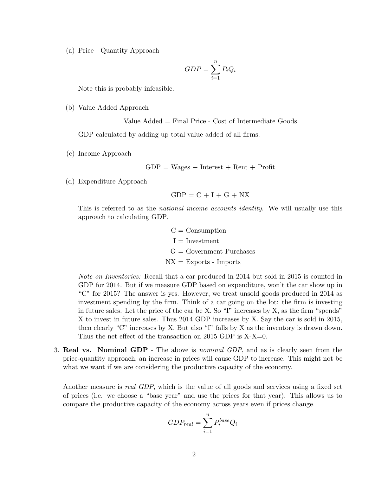
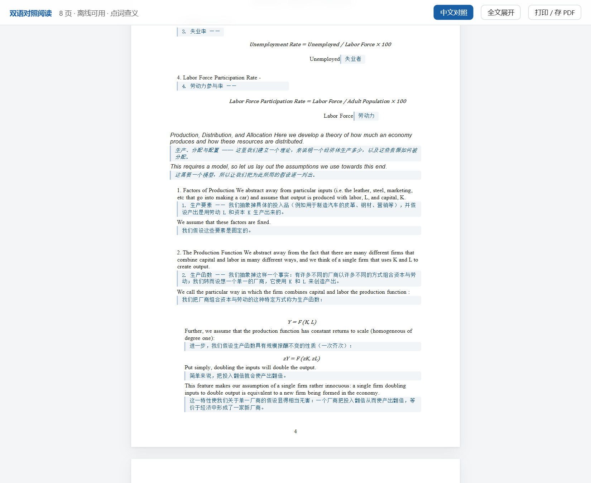

# doc-bilingual-reader

把英文文档（论文 PDF / Word）翻译成中文，生成**一个自包含的 HTML 文件**：

- **保留原版排版** —— PDF 每个字符的坐标被复刻，用绝对定位还原版式
- **逐句中文对照** —— 每句英文下方直接给出中文，不是逐词对照
- **点词查义** —— 每个英文单词可点击，弹出音标、词性、中文释义；释义在生成时预先查好内联
- **离线发音** —— 用浏览器本地语音合成朗读，不联网
- **图表内文字可点** —— 图片区域用 OCR 生成透明热区，图里的词也能点
- **公式识别为文本** —— 公式不走图片裁剪，识别成文本/LaTeX 输出
- **完全离线** —— 图片 base64 内联、词典内联，产物断网可用、可直接转发
- **译文质量有硬性保证** —— 构建时审核，缺句/占位符/未翻译会直接失败

## 效果演示

一份 8 页宏观经济学讲义（LaTeX 排版 PDF）→ 双语对照 HTML：

| 原版 PDF | 双语对照 HTML |
|---|---|
|  |  |
|  |  |

点词查义 —— 音标、词性、中文释义都在本地弹窗里给出，右上角可朗读；
释义在生成时已内联，点击零延迟：


> 截图来自公开课程讲义（Econ 302 Handout 1），仅用于功能演示。

## 扫描件（JSTOR 式双栏论文）

扫描件 + OCR 文字层可以做，但难点不在翻译，在**版式数据清理**，专用脚本有 16 个
（`scripts/scan/`）。**交付前有三个门禁必须全过**：

| 门禁 | 查什么 |
|---|---|
| `build_html.py`（内置） | 译文覆盖率，缺句/占位符/未翻译即失败 |
| `scripts/audit_scan.py` | 模型层 11 类缺陷：页码残留、栏式塌陷、未裁切满页图、页眉碎片、双词干… P0 非空即失败 |
| `scripts/verify_html.js` | 渲染层 6 类：元素重叠、空块、**左右栏是否并排**、外部请求、点词… |

完整流程、**不可调换的执行顺序**、以及十几条已踩过的坑见
`SKILL.md` 的「扫描件 PDF 的额外处理」——先读那一节的第 0 小节再动手。

## 快速使用

把英文文档丢给模型，说「用 doc-bilingual-reader 翻译这个 PDF」即可。

模型会依次执行：

```
extract.py        抽取文本 + 坐标 + 切句        -> model.json
（模型逐句翻译）                                 -> translations.json + terms.json
prefetch_dict.py  预查并内联全部单词释义          -> dict.json
ocr_hotspots.py   识别图表内文字                  -> hotspots.json
build_html.py     生成最终 HTML                   -> out.html
```

## 环境依赖

```bash
PY="C:/Users/zhang/.workbuddy/binaries/python/envs/default/Scripts/python.exe"
"$PY" -m pip install pymupdf pillow numpy rapidocr-onnxruntime
```

- `pymupdf` 必需
- OCR 三项仅用于图表内文字热区，装不上就跳过，其余功能不受影响

## 词典数据源（**强烈建议配置**）

查词在**生成阶段一次性完成**，结果内联进 HTML；点击时是纯本地查表，
零网络请求。不配置词库会大面积「未收录」：

- https://github.com/skywind3000/ECDICT （`ecdict.csv`，77 万词条）

```bash
"$PY" scripts/prefetch_dict.py model.json -o dict.json \
  --terms terms.json --ecdict /path/to/ecdict.csv --max-rank 30000 \
  --cache .dictcache.json --workers 4
```

`--max-rank 30000` 保留高频 3 万词。词库本地命中即用，剩下的才走联网
（百度 `fanyi.baidu.com/sug` → 有道 `dict.youdao.com/suggest`）。

**为什么查词必须在生成时做**：产物是 `file://` 页面，浏览器会拦截对中文
词典接口的跨域调用。实测：

| 数据源 | 浏览器调用 | 服务端调用 |
|---|---|---|
| 有道 suggest | 403，无 CORS 头 | 200，正常 |
| 百度 sug | 无 CORS 头 | 200，词性 + 多义项 |
| dictionaryapi.dev | 有 CORS 头 | 国内不可达 |

服务端没有同源策略，所以查词放在构建时做；运行时零请求，因此**联网与否
都一样能用**。脚本最后打印覆盖率，低于 90% 时 `build_html.py` 会告警。

## 已知限制

- **扫描件不支持** —— 纯图片 PDF 没有文本层，需先 OCR
- **双栏论文可能错序** —— 按 y 坐标排序，左右栏句子可能交错
- **复杂公式转文本可能失真** —— 矩阵、多行对齐、嵌套积分有出错风险
- **中文对照后页面会变长** —— 这是设计使然，不裁切内容
- **生僻词可能未收录** —— 覆盖率高频词即可，术语请写进 `terms.json`
- **生成阶段需要联网** —— 产物离线可用，但生成时若词库不全需联网补查

## 文件结构

```
SKILL.md              完整流程与设计决策
                      扫描件必读「扫描件 PDF 的额外处理」一节
scripts/
  extract.py          阶段1：PDF/docx -> 几何模型 JSON
  merge_lines.py      阶段1b：LaTeX PDF 连字展开 / 碎片合并 / 段落重排
  prefetch_dict.py    阶段3a：预查单词释义并内联
  ocr_hotspots.py     阶段3b：图表内文字 -> 可点击热区
  build_html.py       阶段4：几何模型 + 译文 + 词典 -> 单文件 HTML（带译文门禁）
  audit_scan.py       门禁：模型层 11 类扫描件缺陷，P0 非空即退出码 1
  verify_html.js      门禁：渲染层 6 类（重叠 / 空块 / 左右栏是否并排 / 外部请求…）
  scan/               扫描件版式清理脚本 16 个（执行顺序不可换，见 SKILL.md）
references/
  terms.example.json      领域术语表示例
  formulas.example.json   公式线性化覆盖表示例
examples/             效果演示截图
```

## 设计要点

**为什么用绝对定位** —— PDF 每个字符都有坐标，复刻坐标才能保住多栏、图文环绕等版式；
流式重排必然破坏版式。

**为什么需要 `relayout_page`** —— 中文插到英文下方后元素变高，会撞到下一个元素。
该函数按阅读顺序累加下推，保证永不重叠，页面高度按需增长。

**为什么热区用百分比定位** —— 图片按 `object-fit:contain` 缩放，
百分比让热区与图片同步缩放，不必重算像素。
